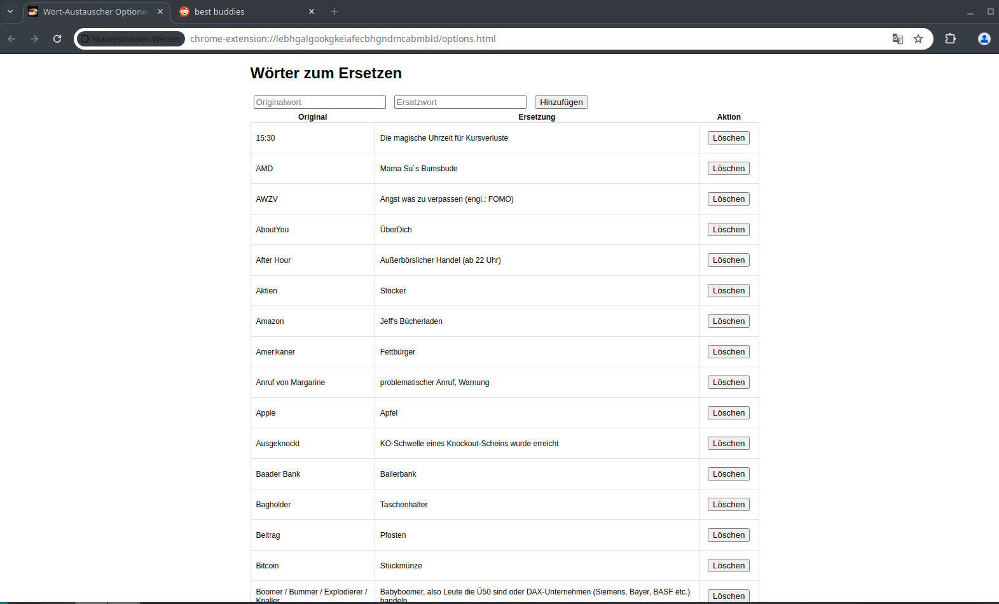

# Mauerstrassenwetten Chrome Extension


## Überblick

Die MauerStrassenWetten Erweiterung ist eine Chrome-Erweiterung, die es Ihnen ermöglicht, bestimmte Wörter oder Phrasen auf Webseiten durch Ihre gewählten Ersatzwörter zu ersetzen. Diese Erweiterung ist nützlich, um Ihr Web-Browsing-Erlebnis anzupassen oder für verschiedene Textverarbeitungsaufgaben.

## Funktionen

- Ersetzen Sie Wörter oder Phrasen auf jeder Webseite.
- Große vordefinierte Wortliste
- Verwenden Sie Regex für fortgeschrittenes Text-Matching.
- Wendet automatisch Ersetzungen auf dynamisch geladene Inhalte an.
- Einfache und benutzerfreundliche Oberfläche.

## Installation

### Manuelle Installation von GitHub

1. Laden Sie das Repository herunter oder klonen Sie es:
    ```sh
    git clone https://github.com/allaboutstrategy/mauerstrassenwetten-extension.git
    ```
2. Öffnen Sie Chrome und navigieren Sie zu `chrome://extensions/`.
3. Aktivieren Sie den "Entwicklermodus" in der oberen rechten Ecke.
4. Klicken Sie auf "Entpackte Erweiterung laden" und wählen Sie den heruntergeladenen Ordner des Repositorys aus.



## Verwendung - Weitere Wörter hinzufügen

1. Suchen Sie das Symbol der Mauerstrassenwetten-Erweiterung in der Chrome-Symbolleiste.
2. Klicken Sie auf die 3 Punkte und wählen Sie "Optionen".
3. Geben Sie die Wörter oder Phrasen ein, die Sie ersetzen möchten, und deren Ersatzwörter.
4. Speichern Sie Ihre Änderungen.
5. Aktualisieren Sie alle geöffneten Webseiten, um die Ersetzungen anzuwenden.
